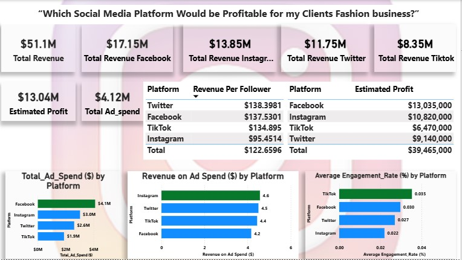

**Which Social Media Platform Would Be Most Profitable for My Client’s Fashion Business?**

**Project Overview**
This project analyzes social media platform performance to determine the most profitable platform for launching and scaling a fashion business.

Using Power BI, I analyzed key business metrics including:
•	Total Revenue
•	Estimated Profit
•	Advertising Spend
•	Revenue Per Follower
•	Return on Ad Spend (ROAS)
•	Engagement Rate

The goal was to provide strategic recommendations to help the client make data-driven marketing and investment decisions.

**Tools & Technologies Used**
•	Power BI
•	Microsoft Excel
•	Data Cleaning
•	Data Visualization
•	Business Intelligence
•	KPI Analysis

**Key Business Insights**
•	Facebook Was the Most Profitable Platform
•	Facebook generated the highest estimated profit, making it the strongest platform for revenue generation and customer conversion.
•	Instagram Delivered the Best Advertising Efficiency
•	Instagram recorded the highest Return on Ad Spend (ROAS), showing strong advertising performance.
•	TikTok Recorded the Highest Engagement Rate
•	TikTok outperformed other platforms in audience engagement and interaction.
•	Twitter Generated the Highest Revenue Per Follower
•	Twitter demonstrated strong monetization efficiency compared to the other platforms.

**Business Recommendation**
A combined strategy using:
•	Facebook for profitability
•	Instagram for efficient advertising
•	TikTok for engagement and audience growth
would provide the strongest digital marketing approach for the client’s fashion business.

**About Me**
I am a Data Analyst skilled in:
•	Power BI
•	Excel
•	SQL
•	Python
•	Data Visualization
•	Business Intelligence
I enjoy transforming raw data into actionable business insights that support strategic decision-making.

Connect With Me
•	LinkedIn: [www.linkedin.com/in/chika-ekwebelem-14b1a124a]
•	GitHub: [https://github.com/apex-data-analytics]
•	Portfolio: [https://github.com/apex-data-analytics/social-media-impact-on-fashion-sales/tree/main]

## Dashboard Preview

